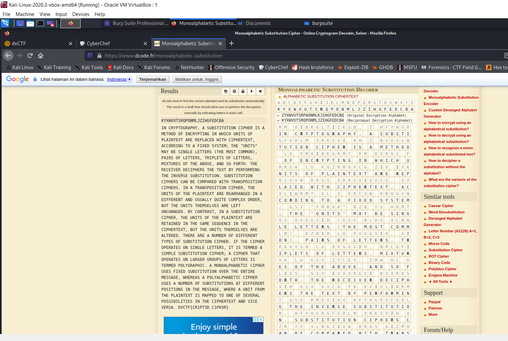

# Davinci CTF

## Subtitution

## Informasi Soal
| Kategori | Poin |
| -------- | ---- |
| Cryptografi | 100 |

### Deskripsi
> Rm xibkgltizksb, z hfyhgrgfgrlm xrksvi rh z nvgslw lu vmxibkgrmt rm dsrxs fmrgh lu kozrmgvcg ziv ivkozxvw drgs xrksvigvcg, zxxliwrmt gl z urcvw hbhgvn; gsv "fmrgh" nzb yv hrmtov ovggvih (gsv nlhg xlnnlm), kzrih lu ovggvih, girkovgh lu ovggvih, nrcgfivh lu gsv zylev, zmw hl uligs. Gsv ivxvrevi wvxrksvih gsv gvcg yb kviulinrmt gsv rmevihv hfyhgrgfgrlm.
>
> Hfyhgrgfgrlm xrksvih xzm yv xlnkzivw drgs gizmhklhrgrlm xrksvih. Rm z gizmhklhrgrlm xrksvi, gsv fmrgh lu gsv kozrmgvcg ziv ivziizmtvw rm z wruuvivmg zmw fhfzoob jfrgv xlnkovc liwvi, yfg gsv fmrgh gsvnhvoevh ziv ovug fmxszmtvw. Yb xlmgizhg, rm z hfyhgrgfgrlm xrksvi, gsv fmrgh lu gsv kozrmgvcg ziv ivgzrmvw rm gsv hznv hvjfvmxv rm gsv xrksvigvcg, yfg gsv fmrgh gsvnhvoevh ziv zogvivw.
>
>Gsviv ziv z mfnyvi lu wruuvivmg gbkvh lu hfyhgrgfgrlm xrksvi. Ru gsv xrksvi lkvizgvh lm hrmtov ovggvih, rg rh gvinvw z hrnkov hfyhgrgfgrlm xrksvi; z xrksvi gszg lkvizgvh lm ozitvi tilfkh lu ovggvih rh gvinvw klobtizksrx. Z nlmlzokszyvgrx xrksvi fhvh urcvw hfyhgrgfgrlm levi gsv vmgriv nvhhztv, dsvivzh z klobzokszyvgrx xrksvi fhvh z mfnyvi lu hfyhgrgfgrlmh zg wruuvivmg klhrgrlmh rm gsv nvhhztv, dsviv z fmrg uiln gsv kozrmgvcg rh nzkkvw gl lmv lu hvevizo klhhryrorgrvh rm gsv xrksvigvcg zmw erxv evihz.
>weXGU{xi1kg3w_x1ks3i}

## Cara Penyelesaian
Diberikan sebuah teks terinkripsi, diketahui dari judul nya adalah subtitution maka dapat diasumsikan bahwa soal tersebut menggunakan cipher subtitution. Maka dengan menggunakan tools online. Dilakukan decode terhadap teks tersebut :

Maka didapatkan hasil sebagai berikut:
>IN CRYPTOGRAPHY, A SUBSTITUTION CIPHER IS A METHOD OF ENCRYPTING IN WHICH UNITS OF PLAINTEXT ARE REPLACED WITH CIPHERTEXT, ACCORDING TO A FIXED SYSTEM; THE "UNITS" MAY BE SINGLE LETTERS (THE MOST COMMON), PAIRS OF LETTERS, TRIPLETS OF LETTERS, MIXTURES OF THE ABOVE, AND SO FORTH. THE RECEIVER DECIPHERS THE TEXT BY PERFORMING THE INVERSE SUBSTITUTION. SUBSTITUTION CIPHERS CAN BE COMPARED WITH TRANSPOSITION CIPHERS. IN A TRANSPOSITION CIPHER, THE UNITS OF THE PLAINTEXT ARE REARRANGED IN A DIFFERENT AND USUALLY QUITE COMPLEX ORDER, BUT THE UNITS THEMSELVES ARE LEFT UNCHANGED. BY CONTRAST, IN A SUBSTITUTION CIPHER, THE UNITS OF THE PLAINTEXT ARE RETAINED IN THE SAME SEQUENCE IN THE CIPHERTEXT, BUT THE UNITS THEMSELVES ARE ALTERED. THERE ARE A NUMBER OF DIFFERENT TYPES OF SUBSTITUTION CIPHER. IF THE CIPHER OPERATES ON SINGLE LETTERS, IT IS TERMED A SIMPLE SUBSTITUTION CIPHER; A CIPHER THAT OPERATES ON LARGER GROUPS OF LETTERS IS TERMED POLYGRAPHIC. A MONOALPHABETIC CIPHER USES FIXED SUBSTITUTION OVER THE ENTIRE MESSAGE, WHEREAS A POLYALPHABETIC CIPHER USES A NUMBER OF SUBSTITUTIONS AT DIFFERENT POSITIONS IN THE MESSAGE, WHERE A UNIT FROM THE PLAINTEXT IS MAPPED TO ONE OF SEVERAL POSSIBILITIES IN THE CIPHERTEXT AND VICE VERSA. DVCTF{CR1PT3D_C1PH3R}
>Flag = DVCTF{CR1PT3D_C1PH3R}

## Flag
Flag berada pada dekripsi akhir yaitu sebagai berikut:
> DVCTF{CR1PT3D_C1PH3R}