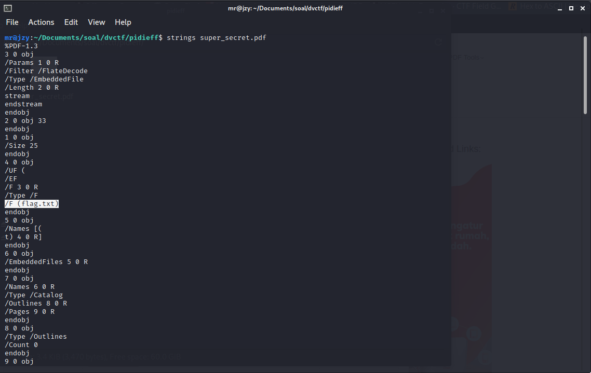

# Davinci CTF

## Pidieff

## Informasi Soal
| Kategori | Poin |
| -------- | ---- |
| Steganografi | 100 |

### Deskripsi

> <a href="super_secret.pdf"> <b>Source Soal</b></a> 
## Cara Penyelesaian
Diberikan sebuah file pdf, setelah dibuka file pdf tersebut ternyata hanya terdapat tulisan:
```
 A Simple PDF File 
 This is a small demonstration .pdf file - 
 just for use in the Virtual Mechanics tutorials. More text. And more 
 text. And more text. And more text. And more text. 
 And more text. And more text. And more text. And more text. And more 
 text. And more text. Boring, zzzzz. And more text. And more text. And 
 more text. And more text. And more text. And more text. And more text. 
 And more text. And more text. 
 And more text. And more text. And more text. And more text. And more 
 text. And more text. And more text. Even more. Continued on page 2 ..
```
Pada text tersebut tidak terdapat petunjuk apa-apa. Maka selanjutnya mencoba untuk memeriksa strings dari pdf.
```
strings super_secret.pdf
```
Maka didapatkan hasil sebagai berikut:


Setelah dibaca-baca pada strings tersebut, ternyata terdapat file tersembunyi bernama flag.txt. Selanjutnya digunakan tools online untuk melakukan ekstrak file pdf tersebut. Dan didapatkan file flag.txt, yang mana didalam file flag.txt tersebut terdapat flag dari soal.

## Flag

> dvCTF{look_at_the_files}