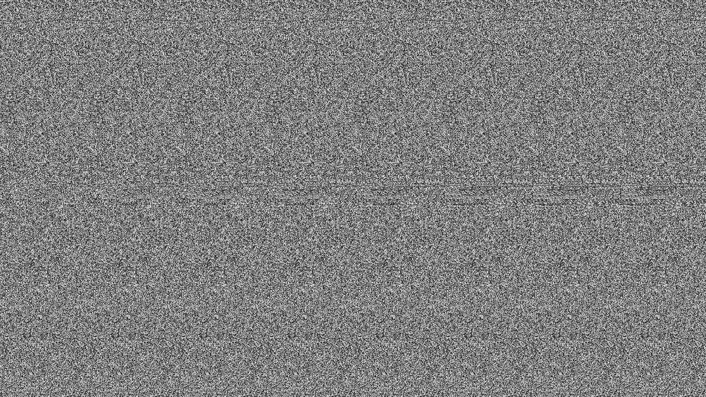

# Davinci CTF

## Read

## Informasi Soal
| Kategori | Poin |
| -------- | ---- |
| Steganografi | 100 |

### Deskripsi
> Just Read!!
> <a href="flag.png"> <b>Source Soal</b></a> 
## Cara Penyelesaian
Diberikan sebuah file images, setelah dibuka ternyata terdapat gambar sebagai berikut:

Terlihat dari gambar tersebut terdapat sebuah bagian yang mencurigakan. Maka selanjutnya menggunakan tools online Magic Eye untuk melihat bagian tersebut
> <a href="https://magiceye.ecksdee.co.uk/"> <b>Tools Online Magic Eye</b></a>

Dan didapatkan hasil sebagai berikut:

## Flag

> dvCTF{th4t5_4_l0t_0f_n0153}