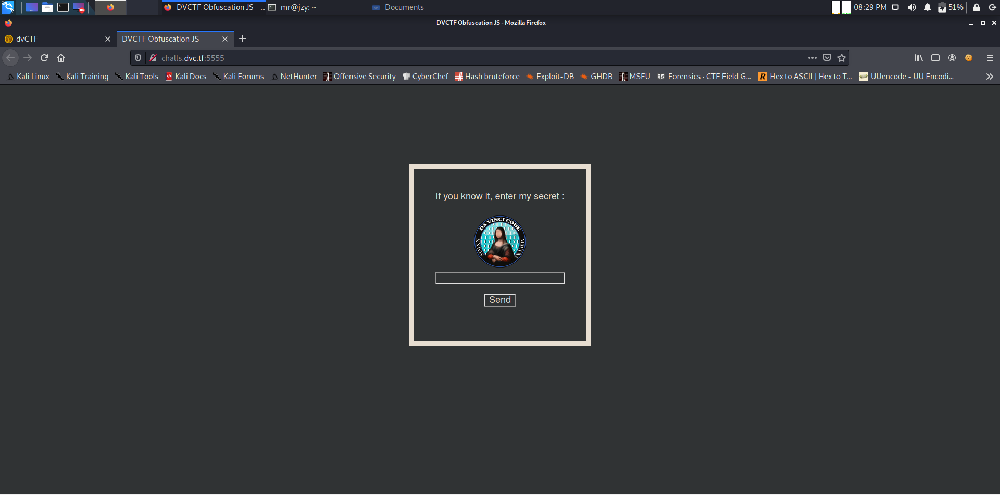
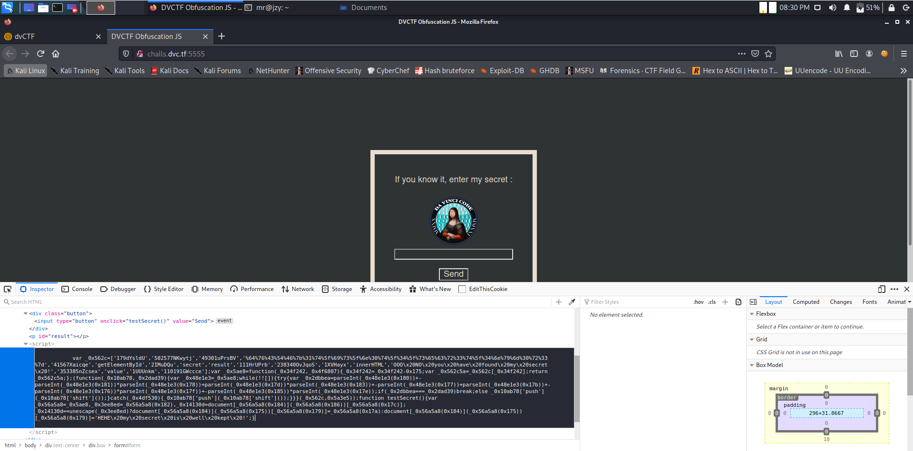
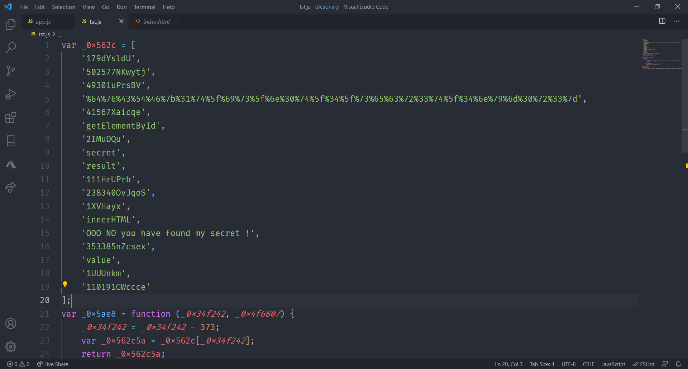
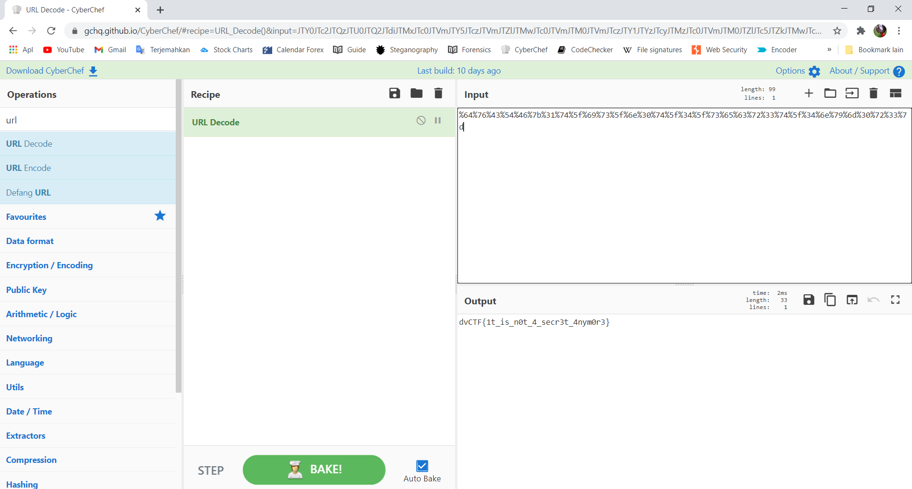

# Davinci CTF

## Obfuscation

## Informasi Soal
| Kategori | Poin |
| -------- | ---- |
| Website | 10 |

### Deskripsi
> My password is my secret. You will never find it...
>
>http://challs.dvc.tf:5555/
>
>To validate this chall, please enter the secret code as the flag.
## Cara Penyelesaian
Dari soal tersebut, saat dibuka menampilkan halaman website sebagai berikut:

Dari judul yang terdapat pada soal yaitu Obfuscation. Maka dapat disimpulkan bahwa soal tersebut merupakan Javascript Obfuscation. Maka selanjutnya dilakukan inpect element dan terdapat source java script.

Agar lebih mempermudah dalam membaca maka script tersebut disalin ke dalam vscode sehingga menjadi seperti berikut.

Terlihat dalam script Javascript tersebut terdapat sebuah text URL encoding yaitu :
```
%64%76%43%54%46%7b%31%74%5f%69%73%5f%6e%30%74%5f%34%5f%73%65%63%72%33%74%5f%34%6e%79%6d%30%72%33%7d
```
Maka dari teks tersebut kemudian dilakukan decode dengan menggunakan decoder url dan dihasilkan sebagai berikut.

Dari hasil tersebut terdapat flag dari soal.
## Flag

> dvCTF{1t_is_n0t_4_secr3t_4nym0r3}