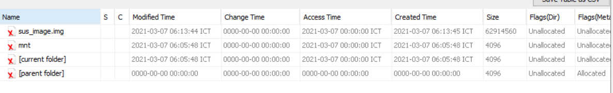
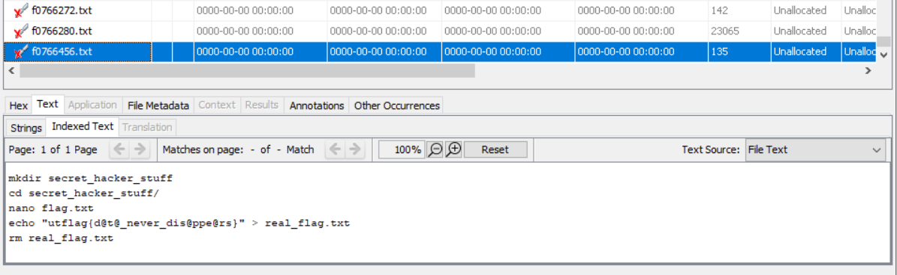

# UTCTF

## Doubly Deleted Data

## Informasi Soal
| Kategori | Poin |
| -------- | ---- |
| Forensic | 1000 |

### Deskripsi

>We got a copy of an elusive hacker's home partition and gave it to someone back in HQ to analyze for us. We think the hacker deleted the file with the flag, but before our agent could find it, they accidentally deleted the copy of the partition! Now we'll never know what that flag was. :(
>
>by Aya Abdelgawad

## Cara Penyelesaian
Diberikan sebuah file img, yang mana dalam file img tersebut apabila dibuka terdapat beberapa file dan partisi. Berdasarkan petunjuk dari soal bahwa ```salinan partisi dan file telah dihapus```. Maka dapat disimpulkan alur untuk mendapatkan flag tersebut adalah sebagai berikut.
1. Melakukan recovery Partisi yang telah terhapus.
2. Kemudian, dari partisi tersebut dilakukan recovery kembali file yang sebelumnya telah dihapus.

Maka pertama saya melakukan recovery partisi tersebut, yang mana dalam file img ditemukan terdapat 2 file sistem.



Dari file tersebut, kemudian saya melakukan recovery terhadap partisi sus_image.img. Setelah berhasil melakukan recovery, selanjutnya saya mencari file berformat txt pada partisi yang sebelumnya telah dilakukan recovery, yang kemungkinan akan terdapat flag dari soal. Maka setelah mencari dan didapatkan hasil berupa flag dari soal.


## Flag

> utflag{d@t@_never_dis@ppe@rs}