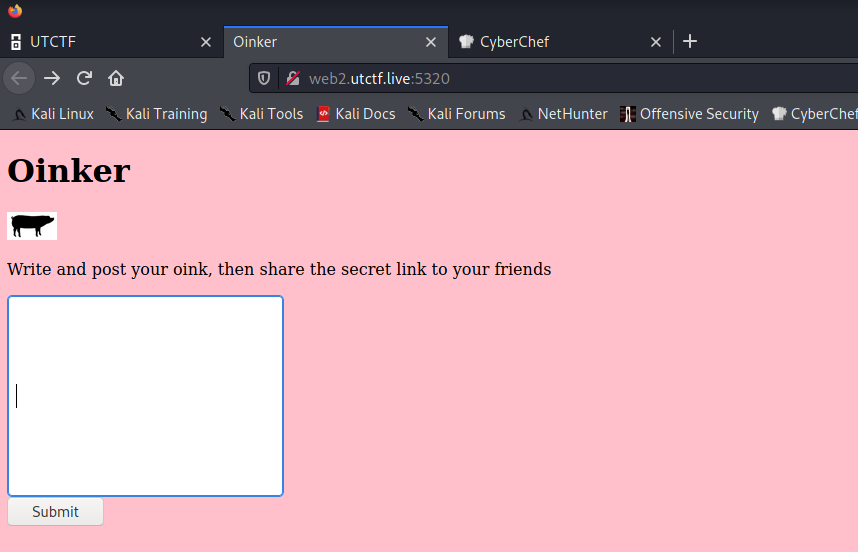
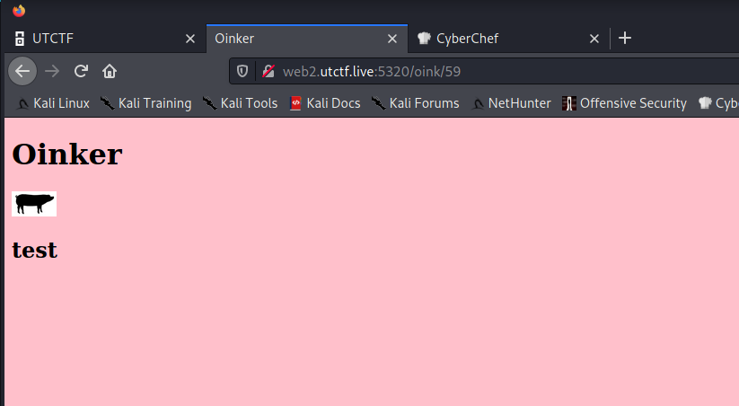
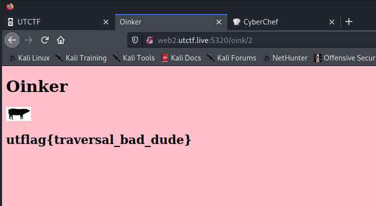

# UTCTF

## Oinker

## Informasi Soal
| Kategori | Poin |
| -------- | ---- |
| Website | 100 |

### Deskripsi

>I found this cool more private alternative to twitter.
>
>http://web2.utctf.live:5320/
>
>-- a1c3


## Cara Penyelesaian
Terdapat sebuah link website, yang mana bila diklik akan menampilkan sebuah halaman sebagai berikut



Dari website tersebut kemudian mencoba untuk melakukan input kata ```test``` untuk melakukan testing. Maka akan dihasilkan output sebagai berikut.



Dari hasil tersebut, apabila kita perhatikan pada URL ```oink/59``` terdapat sebuah angka yaitu 59. Kemudian dilakukan percobaan dengan mengganti angka 59 tersebut ke angka lain dan ternyata menghasilkan output yang berbeda. Dari hal tersebut dapat kita simpulkan jika website tersebut rentan terhadap kerentanan directory transversal. Kemudian setelah dilakukan percobaan pada angka 2 ditemukan flag dari soal sebagai berikut.



## Flag

> utflag{transversal_bad_dude}