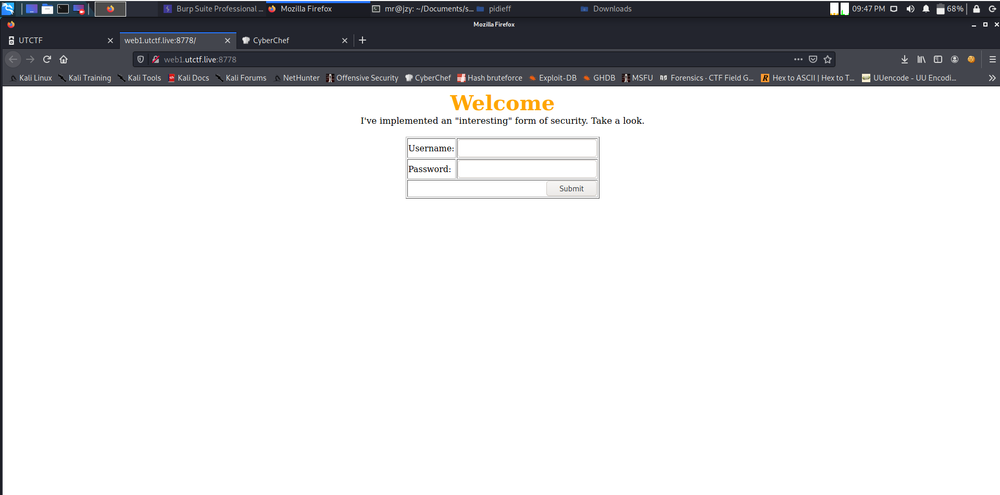
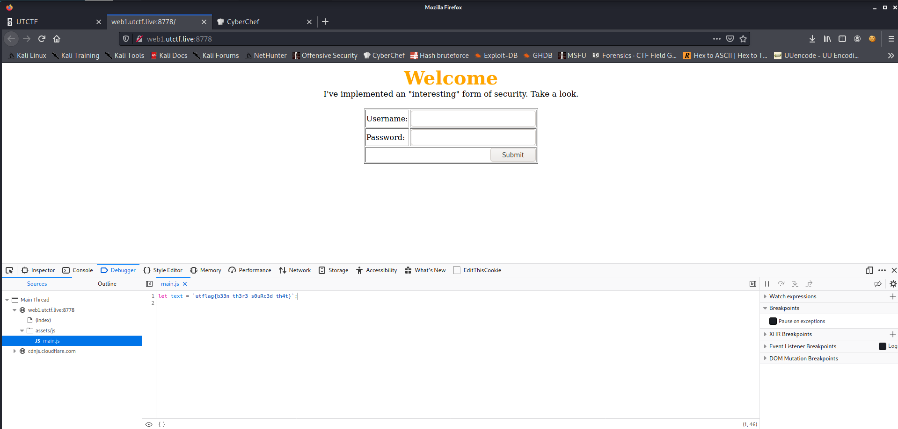

# UTCTF

## Source it! 

## Informasi Soal
| Kategori | Poin |
| -------- | ---- |
| Website | 100 |

### Deskripsi
>
>Can you see how this page handles authentication?
>
>http://web1.utctf.live:8778
>
>by Rob H

## Cara Penyelesaian
Terdapat sebuah website yang mana apabila kita jalankan menampilkan halaman sebagai berikut.



Berdasarkan dari judul soal tersebut adalah ```Source It!``` Maka dilakukan analisa terhadap source code dari website tersebut terlebih dahulu menggunakan inspect element. Kemudian pada file main.js terdapat variabel teks. Yang mana dari variabel teks tersebut diinisialisasikan nilai dari flag.



## Flag

> utflag{b33n_th3r3_s0uRc3d_th4t}