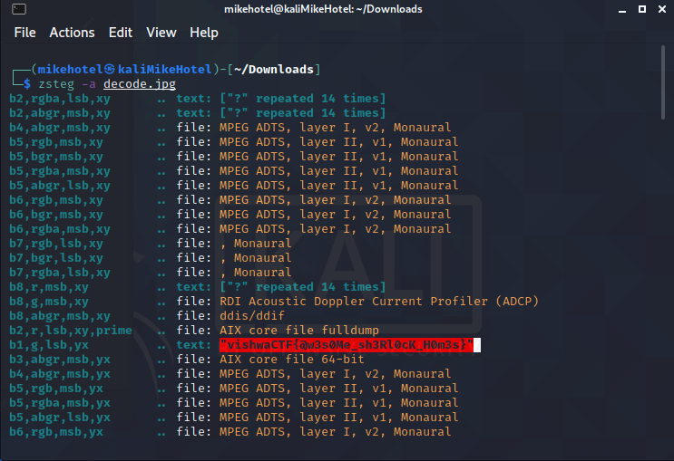

# Vishwa CTF 2021
## Sherlock
### Informasi Soal
| Kategori | Poin |
|----------|------|
| Forensics | 467 |

## Deskripsi
\
Sherlock found a green envelope on its door step and this image.

## Penyelesaian Soal
Diberikan sebuah *clue* untuk mencari *Flag* pada gambar decode.jpg yang berisikan foto Sherlock Holmes\
Disini kami mencoba mencari *Flag* dengan menggunakan tools zsteg pada Kali Linux  
*Command Line* atau Perintah yang kami gunakan sebagai berikut :  
> zsteg -a decode.jpg

Yang mana nanti akan menghasilkan sebuah text menyerupai *Flag* jika kita scroll kebawah  

## Flag
> vishwaCTF{@wes0Me_sh3Rl0cK_H0m3s}
