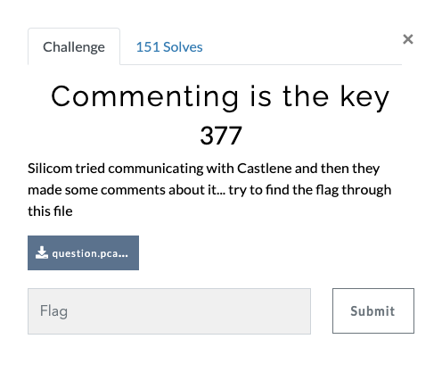
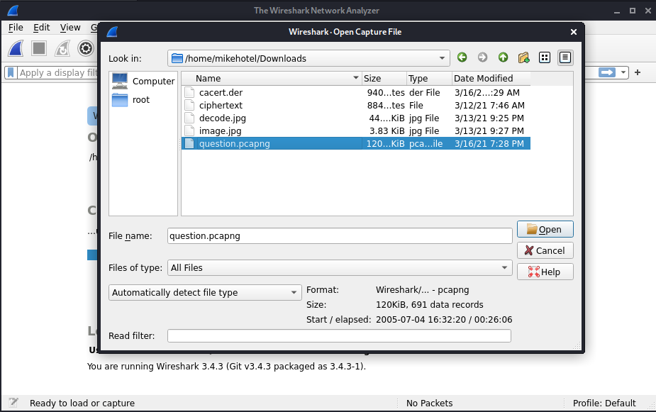
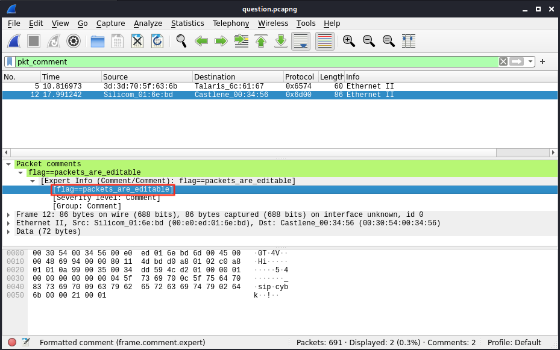

# Vishwa CTF 2021
## Commenting is the key
### Informasi Soal
| Kategori | Poin |
|----------|------|
| Networking | 377 |

## Deskripsi
\
Silicom tried communicating with Castlene and then they made some comments about it... try to find the flag through this file

## Penyelesaian Soal
Diberikan sebuah *clue* untuk mencari *Flag* pada file question.pcapng, dimana kami diminta untuk mencari flag tersembunyi yang ada pada file tersebut dengan hal yang perlu diperhatikan adalah "*comment*". Oleh karena itu kami melakukan beberapa *step* pendekatan untuk mendapatkan nya :
1. Menggunakan *tools* *wireshark* pada Kali Linux
2. Kemudian masukan file dari soal [Comenting is the key](question.pcapng)
3. Lakukan *open file* seperti pada gambar berikut
4. Tuliskan pada *current filter* yaitu *pkt_comment* yang mana akan memberi tahu kepada kita detail dari hal tersebut 
5. Secara otomatis terdapat lah *Flag* nya.

## Flag
> vishwaCTF{packets_are_editable}
