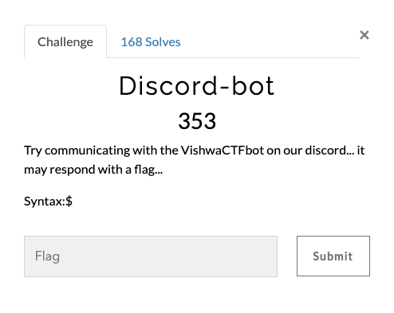

# Vishwa CTF 2021
## Discord-bot
### Informasi Soal
| Kategori | Poin |
|----------|------|
| Warmup | 353 |

## Deskripsi
\
Try communicating with the VishwaCTFbot on our discord... it may respond with a flag...\
```
Syntax:$
```


## Penyelesaian Soal
Diberikan sebuah *clue* untuk mencari *Flag* pada Discord bot milik Vishwa CTF 2021 dengan melakukan chat yang mana\
dimulai dengan *command* atau perintah
> $
> 
<br /> 
Kami mencoba berinteraksi pada bot tersebut sebagai berikut : 
<br />

\


## Flag
> vishwaCTF{d15c0rd_5p1ll3d_th3_b34n5}
