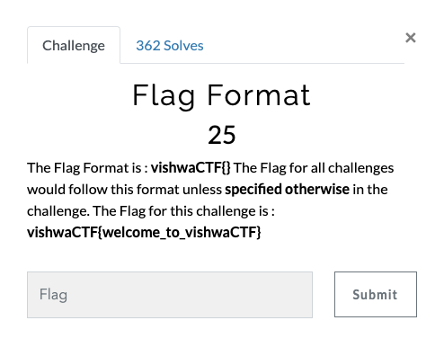

# Vishwa CTF 2021
## Flag Format
### Informasi Soal
| Kategori | Poin |
|----------|------|
| Warmup | 25 |

## Deskripsi
\
The Flag Format is : vishwaCTF{} The Flag for all challenges would follow this format unless specified otherwise in the challenge. The Flag for this challenge is : 
<br />
```
vishwaCTF{welcome_to_vishwaCTF}
```

## Penyelesaian Soal
Diberikan sebuah *clue* untuk memasukan format *Flag* 

## Flag
> vishwaCTF{welcome_to_vishwaCTF}
