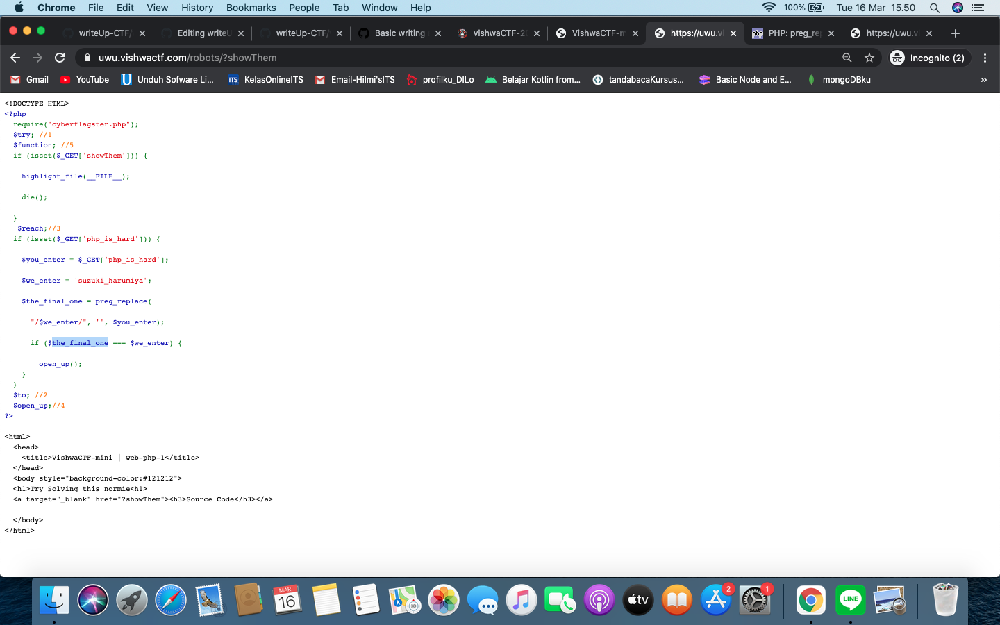

# Vishwa CTF 2021
## UwU
### Informasi Soal
| Kategori | Poin |
|----------|------|
| Web | 443 |

## Deskripsi
\
when php, anime and robots come together. they make hell of a challenge.<br />
[UwU Challenge](https://uwu.vishwactf.com/)

## Penyelesaian Soal
Diberikan sebuah *clue* untuk mencari *Flag* pada Uwu Web yang mana disana tertera jela terdapat ada php, anime, dan robot.\
Setelah meng-eksplor lebih mendalam ternyata clue teresebut berada pada robot dengan link\
[Uwu Robot](https://uwu.vishwactf.com/robot)<br />
Nantinya laman akan ter-*redirect* menuju ke laman berikut :
\
Lalu yang perlu dilakukan adalah mencari *clue* lain berupa php yang kita bisa temukan dari button *source code* laman web tadi yang nantinya akan mengarahkan kita kepada laman berikut :\
\
<br />

Untuk mendapatkan *Flag* kita harus memperhatikan pada bagian
```
<?php
  require("cyberflagster.php");  
  $try; //1
  $function; //5
  if (isset($_GET['showThem'])) {
   
    highlight_file(__FILE__);
   
    die();
  
  }
   $reach;//3
  if (isset($_GET['php_is_hard'])) {
  
    $you_enter = $_GET['php_is_hard'];
  
    $we_enter = 'suzuki_harumiya';
  
    $the_final_one = preg_replace(
    
      "/$we_enter/", '', $you_enter);
  
      if ($the_final_one === $we_enter) {
  
        open_up();
    }
  }
  ```
  Disana jelas tertulis *clue* kita harus memainkan URL/mengubah directory file tersebut kearah yang diminta oleh logika *codingan* tersebut\
  Dengan menggunakan *Php preg_replace()* pada referensi [preg_replace](https://www.php.net/manual/en/function.preg-replace.php)\
  Sehingga URL pun berubah menjadi sebagai berikut
  > https://uwu.vishwactf.com/robots/?php_is_hard=suzuki_hasuzuki_harumiyarumiya
  
  Maka *Flag* pun didapatkan\
  
  
  
  
## Flag
> vishwaCTF{well_this_was_a_journey}
