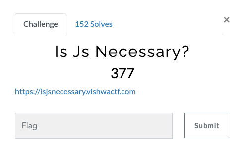
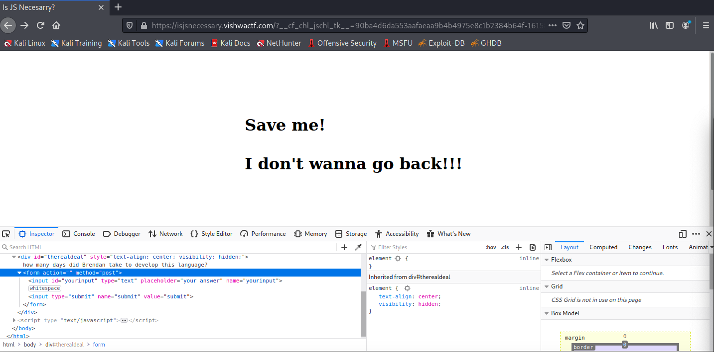
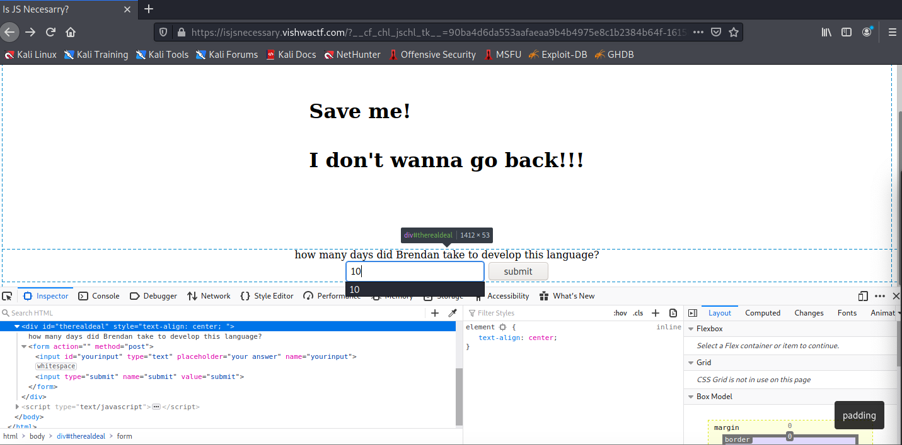
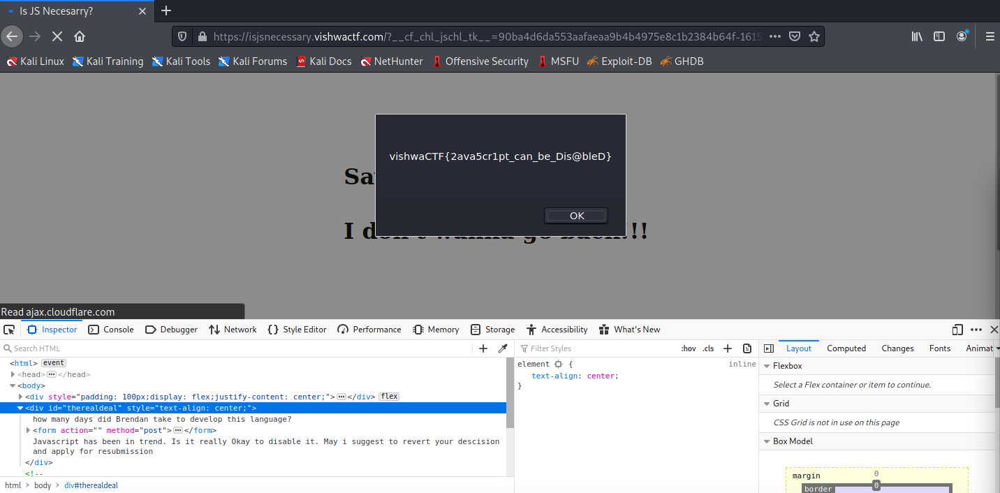

# Vishwa CTF 2021
## Is JS Necessary
### Informasi Soal
| Kategori | Poin |
|----------|------|
| Web | 377 |

## Deskripsi
\
[Is JS Necessary](https://isjsnecessary.vishwactf.com/)

## Penyelesaian Soal
Diberikan sebuah *clue* untuk mencari *Flag* pada web tersebut, yang mana kita perlu menghentikan *redirect web* terlebih dahulu,  
lalu lakukan inspect element dan terdapat hal yang mencurigakan yaitu terdapat sebuah *form* yang *visbility* nya *hidden*.  
Maka yang perlu dilakukan adalah dengan menghapus hal tersebut sebagai berikut :  
\
 
Setelah terhapus *visibility hidden*nya, maka akan muncul sebuah *form* dengan pertanyaan "Berapa lama Brendan untuk menciptakan JavaScript?" 

tentu jawabannya 10 hari berdasarkan  
[Brendan 10 Days Javascript](https://www.checkmarx.com/blog/javascript-history-infographic/#:~:text=Brendan%20Eich%2C%20a%20Netscape%20Communications,language%2C%20then%20known%20as%20Mocha.)  
Dan pada akhirnya muncul lah *Flag*  

## Flag
> vishwaCTF{2ava5cr1pt_can_be_Dis@bleD}
